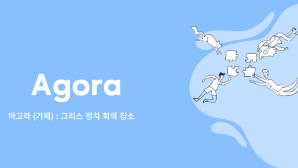

# 프로젝트 아고라 (가제)

## 개요
정치 및 사회 이슈에 관심있는 20 30을 대상으로 커뮤니티를 형성하고 다양한 컨텐츠를 제공하여 사용자로 하여금 즐거움을 주는 커뮤니티를 형성

## 목표
 - 사회적으로 극단적으로 양분화된 형상을 이용하여 사용자로 하여금 자신의 성향에 따라 게시글을 작성하고 거기에 대한 피드백을 받을 수 있는 게시판을 만든다.
 - 2030 세대를 적극 포섭하고 자극적인 컨텐츠를 활용하여 즐거움을 받을 수 있도록 한다.
 - 광고 및 후원 받기를 통해 서비스 운용 비용을 충당한다.

## 개발 환경
- OS : Window 및 MAC
- IDE : VSCode, github co-pilot
- NodeJS : 20.13.0
- Framework : NEXTJS^15.1.6
- DB : PostgreSQL, Redis(필요 시)
- Infra : Docker, AWS EC2

## 마일스톤
###  1주차

세부계획

 - 2월 3일
    - 프로젝트 기획 및 요구사항 분석
 - 2월 4일 
    - 참고 디자인 선정
 - 2월 5일
    - 참고 디자인 선정 및 협업 규칙 세분화, 코딩 컨벤션 선정
 - 2월 6일
    - 개발 환경 동기화 
 - 2월 7일 
    - 프로젝트 설계 및 MVP 도출
 - 2월 8일
    - 미흡점 보완 및 화면 설계
 - 2월 9일
    - 미흡점 보완 및 화면 설계

### 2주차

세부계획

- 2월 10일
   - DB 세팅 및 초기 설계
- 2월 11일
   - DB 설계 검토 및 수정
- 2월 12일
   - DB 설계 검토 및 수정
- 2월 13일
   - DB 설계 검토 및 수정
- 2월 14일
   - DB 설계 검토 및 수정 (주간 회의)
   - 개발 환경 동기화(로컬)
   - 코딩 컨벤션 규칙
- 2월 15일
   - DB 설계 검토 및 수정 
   - 기능 별 할당
- 2월 16일
   - 3~4주차 목표 설정

### 3주차 - 2/17 ~ 2/23

세부계획

- DB 연동
   - 로컬 MySql 세팅
   - Prisma 세팅 및 user, post 테이블 생성
- 공통 레이아웃(헤더, 푸터)
   - 푸터, 헤더, 사이드바 추가
   - 모바일 버전 적용
   - 공통폰트 추가
- 로그인 및 회원가입
   - 회원가입 페이지 및 DB 연동
   - 로그인 기능 추가
   - 로그아웃 기능 추가
- 공통 API 응답객체 세팅
- 채널 관련 DB 세팅
   - 채널 데이터 추가 후 해더와 연동

### 4주차 - 2/24 ~ 3/2
- 호스팅 서버 구매 및 세팅
- 도메인 구매 및 ssl 인증서 세팅
- CI/CD 구축하기
   - 깃허브 액션 사용
- 무중단 배포 환경 구축하기
   - 어떤 방식을 적용할까?
- 게시물 목록
   - 게시물 목록 조회 시 페이지 단위로 조회
   - 페이지네이션 적용
- 게시물 상세보기
   - react-quill 적용 또는 자체 뷰
   - 상세페이지에서 어떤 것을 보여주어야 할까? 
- 게시물 수정하기
   - react-quill 적용
- 게시물 삭제하기 
- 조회수 기능
   - pc별 1회 증가 

### 5주차 - 3/3 ~ 3/9
- 메인페이지 
   - 작성된 채널별 게시물 띄우기 
- 타 유저 신고하기 기능
   - 유저아이디 클릭 --> 신고하기
- 외부 공유하기 기능
   - 공유링크 생성, 클립보드 복사
- 좋아요 기능
   - 게시물 좋아요 누르기(pc별 1번)
- 테스트 코드 작성

### 6주차 - 3/10 ~ 3/16 
- 서브도메인 추가하기
- 관리자 페이지
   - 채널 추가, 채널 아이템 추가 기능
- 유저 신고 목록
- 차단 기능
- 테스트 코드 작성

### 7주차 - 3/17 ~ 3/23
- 메인페이지 개인별 맞춤으로 순서 보여주기 기능
- 인기글 알고리즘 추가 
- 런칭하기

### 8주차 이후
- 주식현황보드 
- 실시간 채팅창 
- 나의 통계